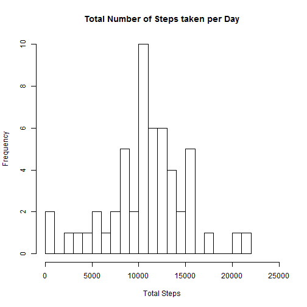
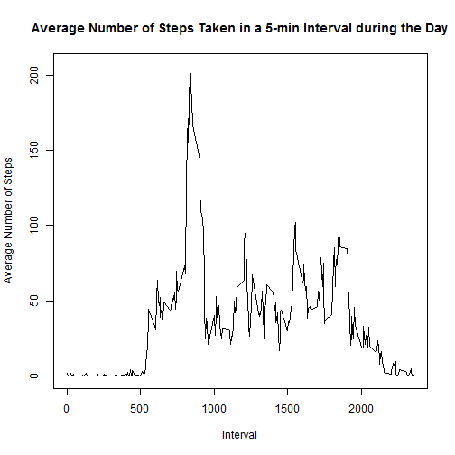
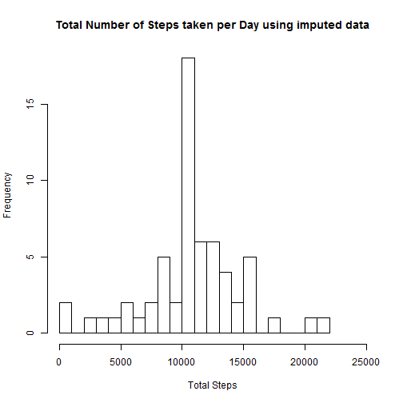
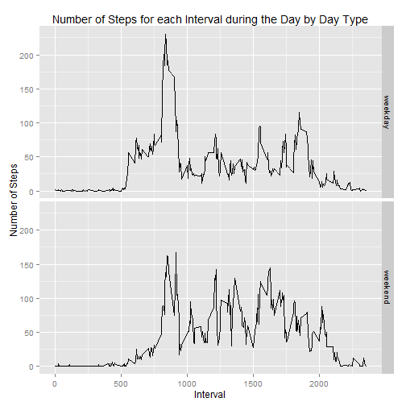

#Reproducible Research: Peer Assessment 1  

##Loading and preprocessing the data  


```r
#Load activity monitoring data
amd_orig<-read.csv("repdata_data_activity/activity.csv")
```

##What is mean total number of steps taken per day?  

Ignore the missing values in the dataset.


```r
amd<-amd_orig[complete.cases(amd_orig),]
```

Calculate the total number of steps taken per day


```r
library(lubridate)
amd$date<-ymd(amd$date)
library(dplyr)
#Group by date, summarize by total steps
result_bydate<-
  group_by(amd,date) %>%
  summarize(total_steps=sum(steps))
```

Make a histogram of the total number of steps taken each day


```r
hist(result_bydate$total_steps,breaks=25,xlim=c(0,25000),xlab="Total Steps",main="Total Number of Steps taken per Day")
```

 

Calculate and report the mean and median of the total number of steps taken per day


```r
ave_steps<-as.integer(summarize(result_bydate,avg_steps=mean(total_steps)))
med_steps<-as.integer(summarize(result_bydate,med_steps=median(total_steps)))
```
The mean and median number of steps is 10766 and 10765, respectively.


##What is the average daily activity pattern?

Make a time series plot of the 5-minute interval (x-axis) and the average number of steps taken, averaged across all days (y-axis)


```r
#Group by interval, summarize by average number of steps  
result_byinterval<-
  group_by(amd,interval) %>%
  summarize(mean_steps=mean(steps))
with(result_byinterval,plot(interval,mean_steps, type="l",xlab="Interval",ylab="Average Number of Steps",main="Average Number of Steps Taken in a 5-min Interval during the Day"))
```

 

Calculate the 5-minute interval, on average across all the days in the dataset, which contains the maximum number of steps


```r
#msteps<-as.integer(which(result$mean_steps==max(result$mean_steps)))
msteps<-which.max(result_byinterval$mean_steps)
```

The 104-th 5-min interval contains the maximum number of steps averaged across all days in the dataset.


##Imputing missing values


Calculate and report the total number of missing values in the dataset (i.e. the total number of rows with NAs)


```r
n_missingvalues<-sum(!complete.cases(amd_orig))
n_orig<-nrow(amd_orig)
```
There are 2304 missing values in the dataset out of a total of 17568 rows

  
Devise a strategy for filling in all of the missing values in the dataset. For example, you could use the mean/median for that day, or the mean for that 5-minute interval, etc.


```r
#Fill in with the mean of the 5 min interval
interval_means<-result_byinterval$mean_steps
```

Create a new dataset that is equal to the original dataset but with the missing data filled in.


```r
#Copy original dataset
amd_imp<-amd_orig
#Replicate the interval means for each of the 61 days
rep_means<-rep(interval_means,61)
#Find the rows with NAs
na_index<-is.na(amd_orig$steps)
#Fill in the missing data with the mean values
amd_imp$steps[na_index]<-rep_means[na_index]
```

Make a histogram of the total number of steps taken each day and Calculate and report the mean and median total number of steps taken per day.


```r
result_bydate_imp<-
  group_by(amd_imp,date) %>%
  summarize(total_steps=sum(steps))
hist(result_bydate_imp$total_steps,breaks=25,xlim=c(0,25000),xlab="Total Steps",main="Total Number of Steps taken per Day using imputed data")
```

 

Do these values differ from the estimates from the first part of the assignment? What is the impact of imputing missing data on the estimates of the total daily number of steps?


```r
ave_steps_imp<-as.integer(summarize(result_bydate_imp,avg_steps=mean(total_steps)))
med_steps_imp<-as.integer(summarize(result_bydate_imp,med_steps=median(total_steps)))
```

The imputed mean and median number of steps is 10766 and 10766, respectively.
This compares with the original values of the mean and median  10766 and 10765, respectively. We can see that the mean and the median of the imputed data is the same as the original (non-imputed) data.


#Are there differences in activity patterns between weekdays and weekends?


```r
#Find rows with either Saturday or Sunday in them by searching for days starting with [S]
i<-grep("^[S]",weekdays(ymd(amd_imp$date)))
#Create a new column called daytype and fill it with zeros
amd_imp$daytype=rep(0,17568)
#Insert 1's where there are weekend days
amd_imp$daytype[i]=1
#Convert to a factor
amd_imp$daytype<-factor(amd_imp$daytype)
#Assign levels
levels(amd_imp$daytype)<-c("weekday","weekend")
```

Make a panel plot comparing the average number of steps taken per 5-minute interval across weekdays and weekends


```r
result_daytype<-
  group_by(amd_imp,daytype,interval) %>%
  summarize(mean_steps=mean(steps))
library(ggplot2)
g<-ggplot(result_daytype, aes(interval,mean_steps))+facet_grid(daytype~.)+
geom_line()+xlab("Interval")+ylab("Number of Steps")+
ggtitle("Number of Steps for each Interval during the Day by Day Type")
print(g)
```

 
